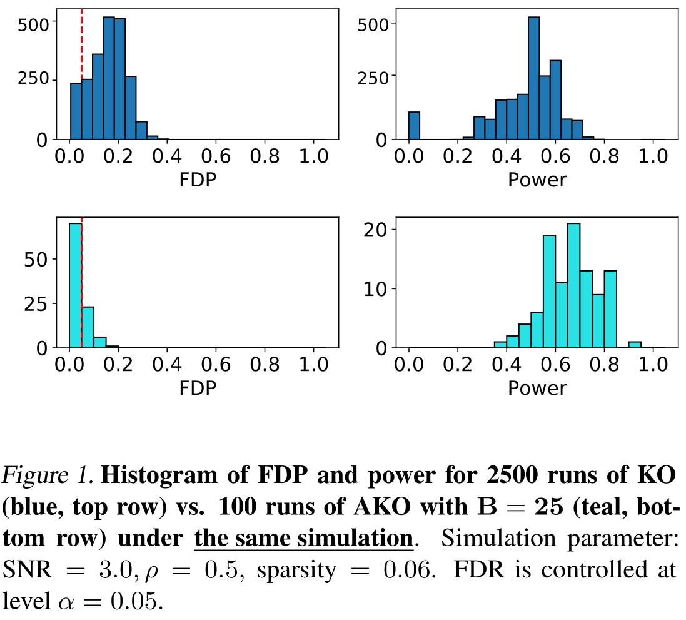

# HiDimStat: High-dimensional statistical inference tool for Python
[![build][TravisCI]][travis]  [![coverage][CodeCov]][cov]

## Installation 

HiDimStat working only with Python 3, ideally Python 3.6+. For installation,
run the following from terminal

```bash
git clone https://github.com/ja-che/hidimstat.git
cd hidimstat
pip install -e .
```

## Dependencies

```
joblib
numpy
scipy
scikit-learn
```

To run examples it is neccessary to install `matplotlib`, and to run tests it
is also needed to install `pytest`.

## Documentation & Examples

As of now in the `examples` folder there is a Python script to reproduce Figure
1 in Nguyen et al. 2020 (see References below). __Warning__: this script
should take quite a long time to run.

```bash
# Run this command in terminal
python plot_fig_1_nguyen_et_al.py
```

<p align="center">
  
</p>


## References

#### Main references:

Ensemble of Clustered desparsified Lasso (ECDL):

* Chevalier, J. A., Salmon, J., & Thirion, B. (2018). __Statistical inference
  with ensemble of clustered desparsified lasso__. In _International Conference
  on Medical Image Computing and Computer-Assisted Intervention_
  (pp. 638-646). Springer, Cham.

Aggregation of multiple Knockoffs (AKO):

* Nguyen T.-B., Chevalier J.-A., Thirion B., & Arlot S. (2020). __Aggregation
  of Multiple Knockoffs__. In _Proceedings of the 37th International Conference on
  Machine Learning_, Vienna, Austria, PMLR 119.

If you use our packages, we would appreciate citations to the aforementioned papers.

#### Other useful references:

For de-sparsified(or de-biased) Lasso:

* Javanmard, A., & Montanari, A. (2014). __Confidence intervals and hypothesis
  testing for high-dimensional regression__. _The Journal of Machine Learning
  Research_, 15(1), 2869-2909.

* Zhang, C. H., & Zhang, S. S. (2014). __Confidence intervals for low dimensional
  parameters in high dimensional linear models__. _Journal of the Royal
  Statistical Society: Series B: Statistical Methodology_, 217-242.

For Knockoffs Inference:

* Barber, R. F; Candès, E. J. (2015). __Controlling the false discovery rate
  via knockoffs__. _Annals of Statistics_. 43 , no. 5,
  2055--2085. doi:10.1214/15-AOS1337. https://projecteuclid.org/euclid.aos/1438606853

* Candès, E., Fan, Y., Janson, L., & Lv, J. (2018). __Panning for gold: Model-X
  knockoffs for high dimensional controlled variable selection__. _Journal of the
  Royal Statistical Society Series B_, 80(3), 551-577.


[TravisCI]: https://travis-ci.com/ja-che/hidimstat.svg?branch=main "travisCI status"
[travis]: https://travis-ci.com/ja-che/hidimstat

[CodeCov]: https://codecov.io/gh/ja-che/hidimstat/branch/main/graph/badge.svg "CodeCov status"
[cov]: https://codecov.io/gh/ja-che/hidimstat
